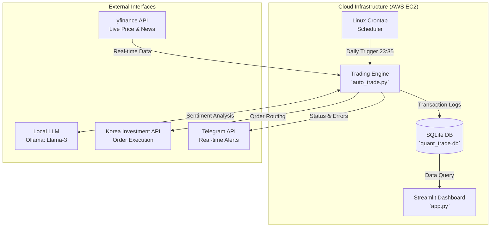

# 📈 NLP 기반 하이브리드 자동 매매 퀀트 시스템


자연어 처리(NLP) 기반의 뉴스 감성 분석과 정량적 기술 지표(RSI, MACD)를 결합한 **하이브리드 퀀트 트레이딩 시스템**입니다. 단순한 백테스트 스크립트를 넘어, AWS EC2 클라우드 환경에서 무중단으로 동작하며 증권사 API 실거래 체결, 트랜잭션 로깅, 웹 대시보드 시각화, 모바일 모니터링 알림 체계를 모두 갖춘 Full-Stack MLOps 파이프라인입니다.

---

## 📊 실시간 퀀트 대시보드 (Live Dashboard)

*(시스템이 24시간 백그라운드로 수집한 매매 타점과 수익률을 시각화합니다.)*


> **Tip:** 대시보드는 현재 AWS EC2 서버에서 24시간 가동 중입니다. (보안상의 이유로 퍼블릭 접근은 제한적일 수 있습니다.)

---

## 🏗 시스템 아키텍처 (Production Pipeline)



---

## 🚀 핵심 비즈니스 로직 및 특징

### 1. 하이브리드 의사결정 엔진 (정성 + 정량)
단순히 LLM의 텍스트 감성 점수에만 의존하지 않습니다. RSI(과매수/과매도)와 MACD(추세 모멘텀) 지표를 교차 검증하여, 뉴스가 아무리 호재여도 **차트가 과열 상태(RSI ≥ 70)이면 기계적으로 매수를 보류**해 고점 휩쏘(Whipsaw) 리스크를 수학적으로 통제합니다.

### 2. 수익률 기반 기계적 리스크 관리 (Stop-Loss / Take-Profit)
증권사 API를 통해 실시간 매입 평균 단가를 파싱합니다. 감정이나 외부 노이즈를 철저히 배제하고 설정된 하드 스톱로스(-5%)와 테이크 프로핏(+15%) 로직을 매수 트리거보다 최우선으로 실행하여 **포트폴리오의 최대 낙폭(MDD)을 강제 방어**합니다.

### 3. MLOps 기반 실시간 모니터링 (Telegram)
서버에 접속하지 않아도 시스템 가동 상태, AI 판단 근거, 매수/매도 체결 영수증 및 치명적 에러 로그가 텔레그램 봇 API를 통해 관리자의 스마트폰으로 즉각 푸시(Push)되는 무인화 운영 체계를 구축했습니다.

---

## 🛠 트러블슈팅 및 아키텍처 리팩토링 (Troubleshooting)

이 프로젝트를 단순한 스크립트에서 상용화 수준(Production-Level)으로 고도화하며 맞닥뜨린 난제들과 엔지니어링 해결 과정입니다.

### 1. 단일 시그널의 한계 극복 및 하이브리드 엔진 도입 (Whipsaw 방어)
- **Problem**: 초기 버전은 LLM의 뉴스 감성 점수에만 의존하여, 홍보성 찌라시에 과민 반응하거나 거시적 경제 악화에 따른 나스닥 전체 하락장 등 '가격 행동(Price Action)'을 무시한 채 고점 매수를 시도하는 결함이 발견되었습니다.
- **Solution**: 검증된 외부 금융 라이브러리(`ta`)를 도입해 아키텍처를 전면 리팩토링했습니다. **[뉴스 감성 + RSI + MACD]**가 모두 충족되어야만 매수하는 다중 조건부 의사결정 트리를 구축했습니다. 뉴스가 호재라도 차트가 과열 상태(RSI ≥ 70)면 매수를 기계적으로 보류하여 휩쏘(거짓 신호) 리스크를 수학적으로 통제했습니다.

### 2. 평균 단가 추적 및 꼬리 위험(Tail Risk) 차단 로직 구현
- **Problem**: 특정 종목에 악재 뉴스가 명시적으로 보도되지 않는 한, 계좌 수익률이 반토막이 나도 매도를 하지 못하는 심각한 방치형 리스크가 존재했습니다.
- **Solution**: 한국투자증권 API 응답에서 '매입 평균 단가'를 파싱하여 실시간 수익률(ROI)을 추적하는 모듈을 개발했습니다. 감정이나 외부 노이즈를 철저히 배제하고 설정된 하드 스톱로스(-5%)와 테이크 프로핏(+15%) 로직을 매수 트리거보다 최우선으로 실행하여 포트폴리오의 **최대 낙폭(MDD)을 강제로 방어**했습니다.

### 3. 로컬 LLM의 비결정적 JSON 붕괴 방어 (Fault Tolerance)
- **Problem**: GPT-4와 달리 로컬 오픈소스 모델(Llama-3)은 프롬프트 지시를 가끔 무시하고 `{"score": 0.5}` 대신 "Here is the result..."와 같은 불필요한 텍스트를 뱉어내어 파이프라인 전체를 `JSONDecodeError`로 마비시켰습니다.
- **Solution**: 단순 파싱이 아닌 정규표현식(Regex)을 도입하고, `try-except` 블록으로 철저히 감쌌습니다. 파싱에 실패할 경우 시스템이 다운되는 대신 강제로 '중립(Score: 0.0)' 값을 리턴하도록 설계하여 **파이프라인의 무중단 가용성을 보장**했습니다.

### 4. 시계열 데이터 결측치(NaN) 정합성 유지 전략
- **Problem**: 주말 등 휴장일이나 통신 지연으로 인해 API 호출 시 주가 데이터에 결측치가 발생하면, 전체 파이프라인이나 대시보드의 데이터 프레임이 어긋나는 현상이 발생했습니다.
- **Solution**: 결측치를 단순히 제거(`dropna`)해버리면 시계열 연속성이 깨져 이동평균 지표 산출에 오류가 생깁니다. 따라서 직전의 유효한 체결가를 현재 가격으로 인식하는 시장 특성을 반영하여 **Forward Fill (`ffill()`)** 방식으로 전처리 파이프라인을 구축, Look-ahead 편향(Bias)과 시계열 왜곡을 동시에 방어했습니다.

### 5. 프론트-백엔드 간 스키마 불일치 연쇄 장애 차단 (Defensive Programming)
- **Problem**: 백엔드 증권사 API 연동 전략 수정으로 반환되는 데이터 형식(Columns)이 변동될 때마다, 이를 읽어오는 프론트엔드 대시보드가 `KeyError`를 뱉으며 하얗게 크래시 되었습니다.
- **Solution**: 데이터 결측이나 형식 불일치 시 시스템이 죽지 않고 유연하게 대처하도록 데이터 프레임의 컬럼 교집합을 먼저 추출(`[col for col in target_cols if col in df.columns]`)하고, 타입 검사 및 예외 처리를 수행하는 **방어적 프로그래밍(Defensive Programming)**을 엄격하게 적용하여 모듈 간 강한 결합을 풀어냈습니다.
---

## ⚙️ 인프라 배포 명세서 (Deployment)

1. **Repository Clone & Virtual Environment**
```bash
git clone [https://github.com/사용자계정/nlp-quant-trade.git](https://github.com/사용자계정/nlp-quant-trade.git)
cd nlp-quant-trade
python3 -m venv venv
source venv/bin/activate
pip install -r requirements.txt
```

2. **Local LLM Init (Ollama & Swap Memory Allocation)**
```bash
# OOM 방지를 위한 Swap 설정 필수
sudo fallocate -l 4G /swapfile
sudo chmod 600 /swapfile
sudo mkswap /swapfile
sudo swapon /swapfile

curl -fsSL [https://ollama.com/install.sh](https://ollama.com/install.sh) | sh
ollama pull llama3
```

3. **Background Dashboard Serving**
```bash
# AWS 보안 그룹 8501 포트 개방 필요
nohup streamlit run app.py --server.port 8501 --server.address 0.0.0.0 &
```

4. **Batch Scheduler Config (Crontab)**
```bash
crontab -e
# KST 23:35 (미국장 개장 후 변동성 안정화 시점) 데일리 트리거
# 35 23 * * 1-5 cd /home/ubuntu/nlp-quant-trade && /home/ubuntu/nlp-quant-trade/venv/bin/python auto_trade.py >> cron_execution.log 2>&1
```
