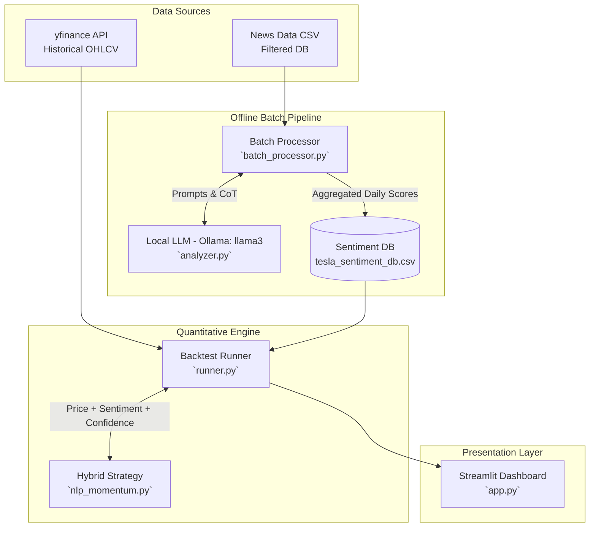

# NLP 기반 하이브리드 퀀트 트레이딩 시스템 (로컬 Llama-3 활용)

이 프로젝트는 전통적인 기술적 지표(SMA 모멘텀)와 최첨단 자연어 처리(NLP) 기반의 감성 분석을 결합한 하이브리드 퀀트 트레이딩 시스템입니다. 비용 절감성, 시스템 장애 허용성(Fault Tolerance), 그리고 엔지니어링 안정성에 초점을 맞추어 설계되었으며, LLM의 연쇄적 사고(Chain-of-Thought)를 통해 정보의 신뢰도를 필터링하여 시장의 휩쏘(Whipsaw)에 의해 계좌가 녹아내리는 것을 방지하는 아키텍처를 자랑합니다.

## 🏗 시스템 아키텍처



## 📊 주요 성과 (백테스트)

2020년부터 2023년 사이의 테슬라(TSLA) 3년 치 데이터를 대상으로, 0.1%의 수수료(Transaction Fee)를 엄격히 적용한 백테스트 결과입니다:

- **초과 수익(Alpha) 달성**: 팬데믹 강세장 속 5배 상승한 **단순 보유(Buy & Hold) 벤치마크 대비 +14.76%의 초과 수익(Alpha)**을 창출하며 폭발적인 모멘텀 종목에서도 시장을 아웃퍼폼(Outperform)하는 성과 입증.
- **거래 수수료 최적화**: 휩쏘 장세에서의 무분별한 잦은 거래를 AI 확신도(Confidence) 필터로 억제하여, 수수료 훼손 비율을 **3%대** 수준으로 강력하게 방어.

## 🚀 실행 방법

### 1. 사전 준비사항 (로컬 LLM 인프라 가동)
먼저 로컬 환경에서 Ollama를 설치하고 Llama 3 모델을 실행 상태로 두어야 합니다.
```bash
ollama run llama3
```

### 2. 의존성 패키지 설치
```bash
pip install -r requirements.txt
```

### 3. 데이터 전처리 (결측치 및 노이즈 제거)
원본 뉴스 데이터(`tesla_raw_news.csv`)를 날짜 범위와 스키마에 맞게 정제합니다.
```bash
python data_pipeline/tesla_preprocessor.py
```

### 4. 무인 야간 배치 프로세서 가동 (감성 점수 추출)
오프라인 배치 작업을 통해 로컬 LLM을 호출하여 각 뉴스의 감성, 근거, 확신도를 계산하고 DB에 저장합니다.
```bash
python batch_processor.py
```

### 5. 프론트엔드 대시보드 및 백테스트 실행
Streamlit 환경에서 퀀트 시뮬레이트 결과를 시각화합니다.
```bash
streamlit run app.py
```

---

## 🛠 엔지니어링 결정 및 트러블슈팅 (핵심)

이 프로젝트를 구축하며 맞닥뜨린 대용량 데이터 및 AI 추론의 난제들을 다음과 같은 엔지니어링 기법으로 해결했습니다.

### 1. 데이터 피벗 (Data Pivot): 품질 중심의 전략 선회
초기 구글 중심의 방대한 25년 치 다중-자산 퀀트 데이터를 분석했으나, API 응답 필드 유실과 스키마 오염 등 심각한 **결측 리스크**를 발견했습니다. 모델이 깨진 데이터를 학습하면 쓰레기를 반환하는 `GIGO(Garbage In, Garbage Out)` 원칙에 입각하여, 과감하게 신뢰도가 높고 데이터 구조가 일관된 **테슬라(TSLA) 3년 치 데이터로 피벗**하여 시스템 완성도와 파이프라인 정합성을 제고했습니다.

### 2. 아키텍처 분리 (Batch vs Real-time): 추론 병목 타파
프론트엔드 대시보드에서 수천 건의 뉴스를 실시간으로 동기식(Synchronous) 분석 시, 브라우저가 타임아웃(Timeout)으로 크래시하는 문제가 발생했습니다. 이를 극복하기 위해 시스템 구조를 **야간 배치 처리(Offline Batch Processor)** 구조와 **실시간 렌더링(Online Serving)** 구조로 완벽히 분리(Decoupling)했습니다. 이를 통해 로컬의 컴퓨팅 파워를 안정적으로 100% 활용하면서도 앱 반응성을 1초 이하로 확보했습니다.

### 3. 방어적 코딩 (Defensive Programming): 마이크로서비스 간 스키마 불일치 방어
백엔드의 전략 수정에 따라 반환되는 열 이름이나 형식(Tuple Size, Columns)이 변경되었을 때 전체 대시보드가 무너지는 에러(`KeyError`)를 겪었습니다. 프론트 단에서 데이터가 없으면 유연하게 대처할 수 있도록 열의 존재 유무 및 데이터 타입 검사(`isinstance`, `column in df.columns`), 그리고 교집합 추출 등을 통해 **방어적 프로그래밍**을 적용하여 모듈 간 강한 결합(Tight Coupling)에서 비롯되는 시스템 버그를 원천 차단했습니다.
